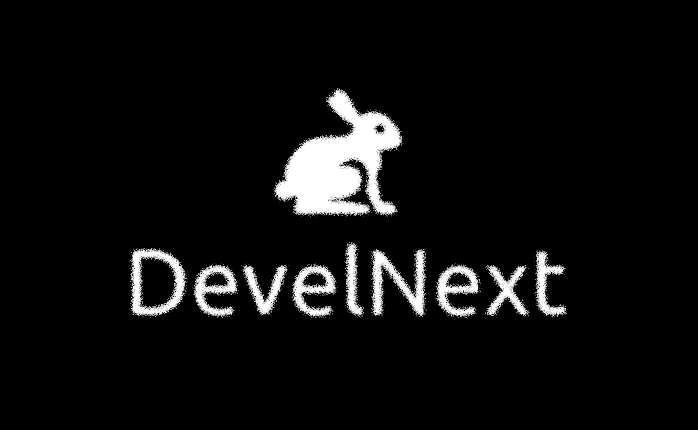

# DevelNext 26

> GUI and IDE for PHP powered by JPHP.



> **Current modernization branch:** JDK 25 / JavaFX 25 / Gradle 9.x.

---

## Current toolchain

- **JDK 25**
- **JavaFX 25.0.4**
- **Gradle 9.7.1**
- **JPHP** built from source
- **JPHP GUI / Wizard / RichTextFX** built from source
- **Launch4j** for Windows application packaging
- **MPL 2.0**

The current build no longer requires the old Java 8 + JavaFX 8 runtime or manual unpublished JPHP artifacts in `~/.m2`.

## Build the IDE

Clone the repository with submodules:

```bash
git clone --recursive <repository-url>
cd develnext
```

If the repository was cloned without submodules:

```bash
git submodule update --init --recursive
```

### Windows

```bat
gradlew.bat distIdeWindows
```

The Windows distribution is generated in:

```text
develnext/build/install/develnext
```

The build prepares the required source-based JPHP/Wizard dependencies through the repository-local build flow.

### Linux

The project still contains a Linux distribution task:

```bash
./gradlew distIdeLinux
```

The current modernization work has primarily been verified on Windows, so Linux should be treated as requiring a separate smoke test.

## Development status

The Java 25 modernization currently covers the legacy IDE/runtime path:

- IDE startup
- project loading
- PHP source editing and syntax highlighting
- visual `FormEditor`
- bundle loading
- JPHP application execution
- JavaFX 25 desktop forms
- clean IDE/runtime shutdown
- Windows distribution build

The project format is intentionally kept compatible with legacy DevelNext projects where possible.

## License

Licensed under the **Mozilla Public License 2.0 (MPL-2.0)**.

https://www.mozilla.org/MPL/2.0/

---

# Русский

> GUI и IDE для PHP на базе JPHP.

## Текущий стек

- **JDK 25**
- **JavaFX 25.0.4**
- **Gradle 9.7.1**
- **JPHP** собирается из исходников
- **JPHP GUI / Wizard / RichTextFX** собираются из исходников
- **Launch4j** используется для упаковки Windows-приложений
- лицензия **MPL 2.0**

Старая обязательная связка Java 8 + JavaFX 8 больше не является основой текущей ветки модернизации.

## Сборка IDE

Клонируйте репозиторий вместе с подмодулями:

```bash
git clone --recursive <repository-url>
cd develnext
```

Если репозиторий уже был клонирован без подмодулей:

```bash
git submodule update --init --recursive
```

### Windows

```bat
gradlew.bat distIdeWindows
```

Готовый дистрибутив:

```text
develnext/build/install/develnext
```

Необходимые JPHP/Wizard-зависимости собираются из исходников через локальный build flow репозитория — вручную подкладывать старые SNAPSHOT JAR в `~/.m2` не требуется.

### Linux

В проекте остаётся задача:

```bash
./gradlew distIdeLinux
```

Основная проверка текущей модернизации выполнялась на Windows, поэтому Linux требует отдельного smoke-теста.

## Статус

На JDK 25 / JavaFX 25 уже проверены:

- запуск IDE
- открытие проекта
- PHP-редактор и подсветка синтаксиса
- визуальный дизайнер форм
- загрузка bundles
- запуск JPHP-приложения
- JavaFX 25 UI
- корректное завершение процессов
- сборка Windows-дистрибутива

## Лицензия

Проект распространяется по лицензии **Mozilla Public License 2.0 (MPL-2.0)**.

https://www.mozilla.org/MPL/2.0/
